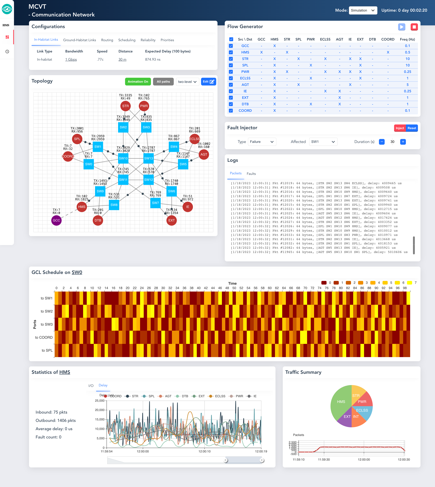

# RETHi Communication Network Emulator

https://purdue.edu/rethi



## Usage

`docker build -t amyangxyz111/rethi-comm . && docker compose up --force-recreate`

Change Local/Remote IP addresses and ports in the `docker-compose.yml` if necessary


## Application-layer Protocol

On top of UDP

```
                    1                   2                   3
0 1 2 3 4 5 6 7 8 9 0 1 2 3 4 5 6 7 8 9 0 1 2 3 4 5 6 7 8 9 0 1 2
+-+-+-+-+-+-+-+-+-+-+-+-+-+-+-+-+-+-+-+-+-+-+-+-+-+-+-+-+-+-+-+-+
|      SRC      |       DST     | TYPE  | PRIO  |  VER  |  RES  |
+-+-+-+-+-+-+-+-+-+-+-+-+-+-+-+-+-+-+-+-+-+-+-+-+-+-+-+-+-+-+-+-+
|                     PHYSICAL_TIMESTAMP                        |
+-+-+-+-+-+-+-+-+-+-+-+-+-+-+-+-+-+-+-+-+-+-+-+-+-+-+-+-+-+-+-+-+
|                     SIMULINK_TIMESTAMP                        |
+-+-+-+-+-+-+-+-+-+-+-+-+-+-+-+-+-+-+-+-+-+-+-+-+-+-+-+-+-+-+-+-+
|            SEQUENCE           |              LEN              |
+-+-+-+-+-+-+-+-+-+-+-+-+-+-+-+-+-+-+-+-+-+-+-+-+-+-+-+-+-+-+-+-+
|      DATA…
+-+-+-+-+-+-+-+-+
```

## Code structure

### Backend - Golang

- `main.go`: entry and configurations (some from env)
- `subsys.go`: a UDP server/client represents an outside subsystem
- `switch.go`: emulate TSN MIMOMQ switch, follows 802.1Qbv schedule
- `gate.go`,`link.go`: emulate the gates and cables of TSN switches 
- `topo.go`: form the topology and find routing paths
- `packet.go`: define the app-layer protocol format
- `db.go`: database connector, mainly for topo and statistics
- `web.go`: set up a Web server
- `utils.go`: utility functions
  
### Frontend - Vue+ECharts


